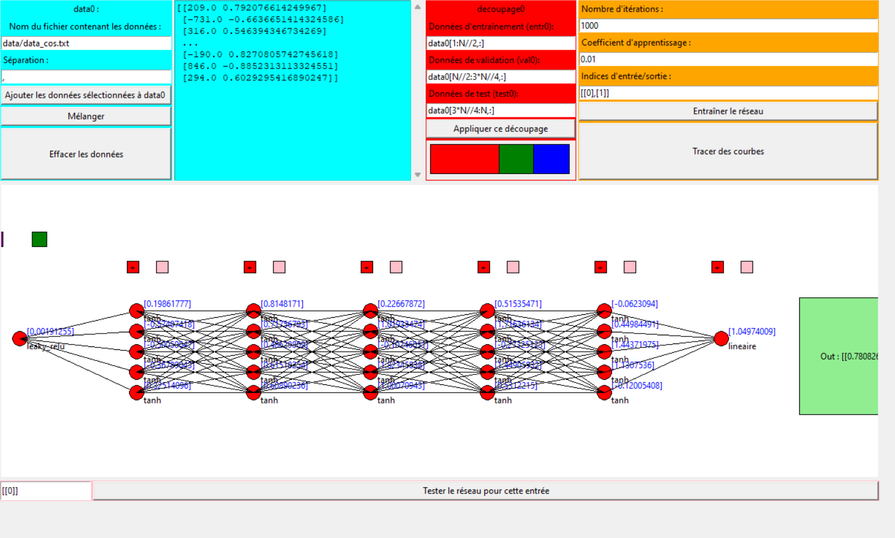
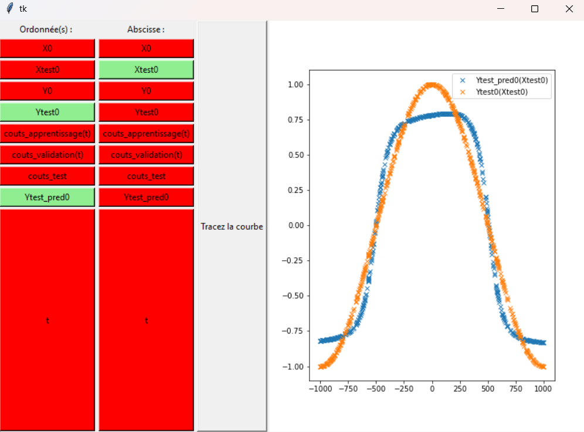

# Réseaux-de-neurones-FeedForward-2025-
Interface qui permet de visualiser les résultats associés à un réseau de neurone de type FeedForward.

Utilisation du fichier : télécharger le fichier RN.py et le lancer.
Une interface s'ouvre alors, on y trouve 5 zones :
- en cyan, la partie qui permet de récupérer la data sur votre ordinateur, qui permettra d'entraîner, valider et tester votre réseau de neurones.

  

- en rouge, la partie de décomposition qui permet justement de décomposer la partie extraite en une partie qui sera entraînée, une autre qui servira de validation et l'autre de test.
- en orange, les hyperparamètres de notre réseau de neurones
    - en cliquant sur le bouton entraîner le réseau, les poids de chaque neurone vont être déterminé.
    - en cliquant sur le bouton tracé les courbes, on pourra représenter plusieurs graphes, notamment l'évolution des coups au cours des itérations. 
- le canvas du centre permet de modifier la géométrie du réseau de neurones :
    - les boutons rouges permettent d'ajouter des couches
    - les boutons roses permettent de modifier les caractéristiques et le dimensionnement de cette couche de réseau.
    - en déplaçant la souris sur les extrémités du canvas, il est possible de se déplacer sur celui-ci.
- enfin la partie rose permet d'utiliser le réseau à l'aide d'une valeur à fournir

# Exemple
Par exemple, on veut que notre réseau de neurone apprenne à imiter la fonction cos
  

Pour celà on entre les différents hyperparamètres représentés sur la figure ci-dessus.
On peut visualiser directement la prédiction et la comparer avec le résultat attendu du test :

  

On peut également observer l'évolution des couts lors de l'apprentissage : 

  

